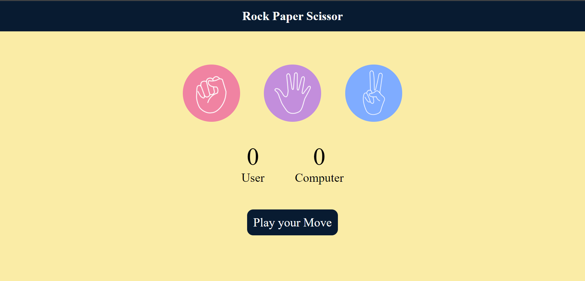

# Rock Paper Scissor Game

A simple web-based **Rock Paper Scissor** game where users can compete against the computer. The game is built using **HTML**, **CSS**, and **JavaScript**. Play your move and see if you can beat the computer!

## Table of Contents
- [Features](#features)
- [Installation](#installation)
- [Usage](#usage)
- [Screenshot](#screenshot)
- [Contributing](#contributing)
<!-- - [License](#license) -->

## Features
- User can choose between **Rock**, **Paper**, and **Scissor**.
- The computer randomly selects a move.
- The game shows a message with the result (win, lose, or draw).
- Scores for both the user and the computer are updated after every round.
- Simple and clean user interface.

## Installation
1. Clone the repository:
    ```bash
    git clone https://github.com/your-username/rock-paper-scissor.git
    ```
2. Navigate to the project directory:
    ```bash
    cd rock-paper-scissor
    ```
3. Open `index.html` in your browser to start the game.

## Usage
Click on **Rock**, **Paper**, or **Scissor** to make your move, and the computer will randomly choose its own. The winner is determined according to the rules:
- Rock beats Scissor
- Scissor beats Paper
- Paper beats Rock

<!-- ### Live Demo
You can check out the live demo of the game [here](#) (Replace with your live URL). -->

## Screenshot



## Contributing
Contributions are welcome! If you'd like to contribute, please follow these steps:
1. Fork the repository.
2. Create a new branch (`git checkout -b feature-branch`).
3. Make your changes and commit them (`git commit -m 'Add some feature'`).
4. Push to the branch (`git push origin feature-branch`).
5. Create a pull request.

